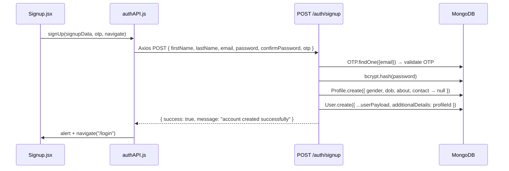
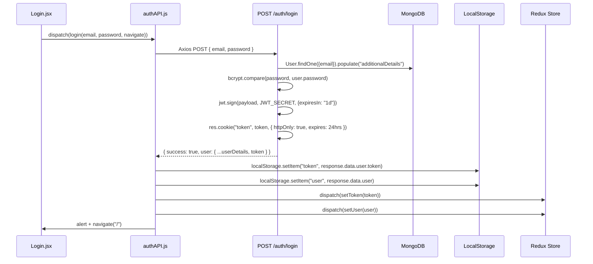
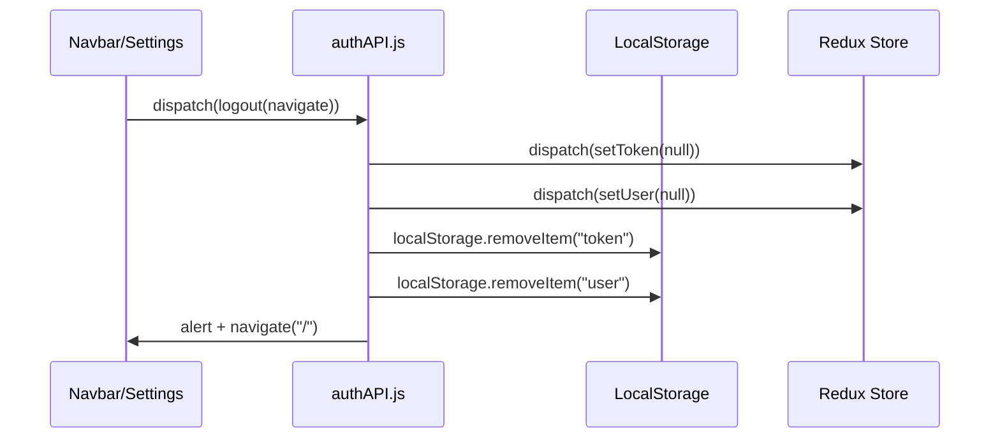
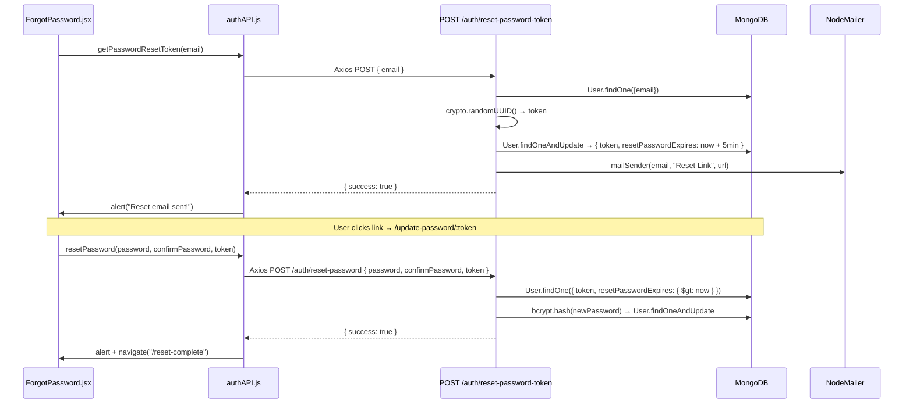
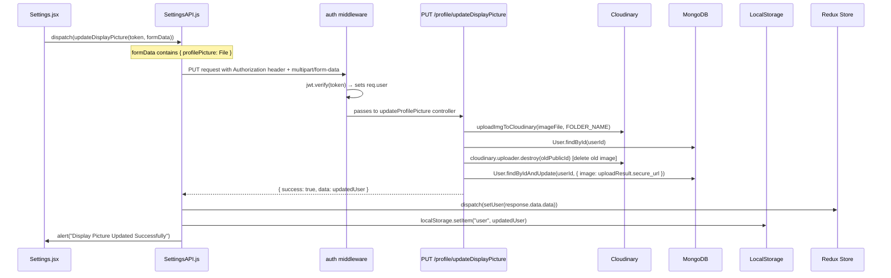
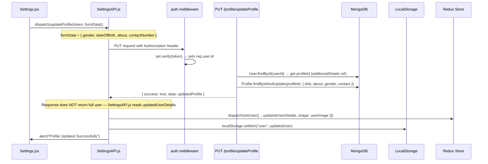
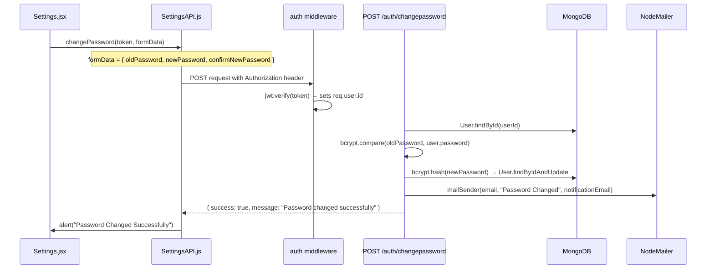
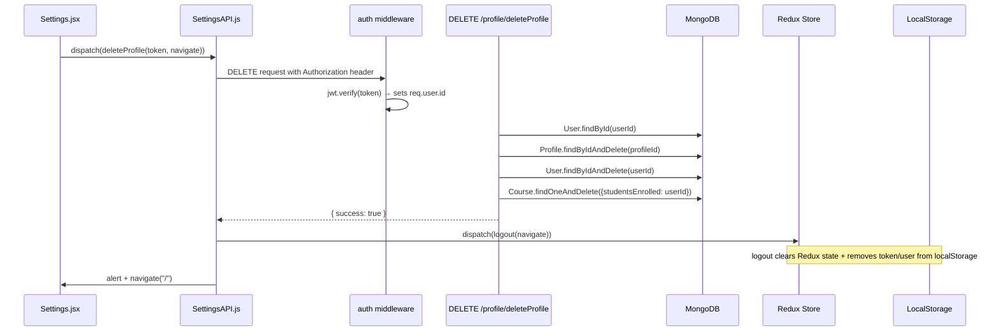

# EduTech API Data Flow Analysis

## Architecture Overview

```
React Component → Redux Dispatch → Service Function (authAPI/SettingsAPI) → apiConnector (Axios) → Express Route → Middleware (auth) → Controller → MongoDB → Response → Redux Store + LocalStorage
```

---

## 🔐 Auth Flows

### 1. Signup Flow



**Key Note**: No token is returned on signup. User must login separately.

---

### 2. Login Flow



> [!IMPORTANT]
> The token lives in **two places**: as an `httpOnly` cookie (for server-side auth) AND in `localStorage` (for frontend Redux state). The frontend reads from `localStorage`, the middleware reads from the cookie/Authorization header.

---

### 3. Logout Flow



---

### 4. Forgot Password Flow



---

## ⚙️ Settings Flows

All settings routes are **protected** — the `auth` middleware runs first to verify the JWT from the `Authorization: Bearer <token>` header.

### Auth Middleware (runs on every protected route)

```
Request Header: { Authorization: "Bearer <jwt_token>" }
    ↓
auth middleware → jwt.verify(token, JWT_SECRET)
    ↓
Attaches req.user = { email, id, role }
    ↓
Passes to Controller
```

---

### 5. Update Profile Picture



---

### 6. Update Profile (Bio/Contact/Gender)



> [!WARNING]
> The backend `updateProfile` returns `data: updatedProfile` (just the Profile doc), but the frontend reads `response.data.updatedUserDetails`. **This is a mismatch** — the frontend expects a key `updatedUserDetails` but the backend sends `data`. This may cause the user in Redux to not update correctly.

---

### 7. Change Password



---

### 8. Delete Account



---

## 📦 State Management Summary

| Data | Where Stored | When Set | When Cleared |
|------|-------------|----------|--------------|
| `token` | Redux + LocalStorage | On login | On logout / account delete |
| `user` | Redux + LocalStorage | On login, profile update, picture update | On logout / account delete |
| `cart` | Redux + LocalStorage | On addToCart | On removeFromCart / resetCart |
| `total` | Redux + LocalStorage | On addToCart | On removeFromCart / resetCart |
| `totalItems` | Redux + LocalStorage | On addToCart | On removeFromCart / resetCart |

---

## ⚠️ Known Issues / Things to Fix

1. **Profile update response key mismatch**: Backend returns `data` but frontend reads `updatedUserDetails` → Redux user state won't update after profile edit.
2. **Token not in JSON body**: The login response doesn't include `response.data.token` directly — it's nested as `response.data.user.token`. The frontend handles this with `response.data.token || response.data.user?.token`.
3. **Password reset token expiry**: Only 5 minutes — may be too short for email delivery delays.
4. **Cookie is httpOnly**: The cookie is correctly `httpOnly`, but the backend auth middleware should be reading it from `req.cookies.token` OR `req.headers.authorization`. Check that the middleware handles both.
